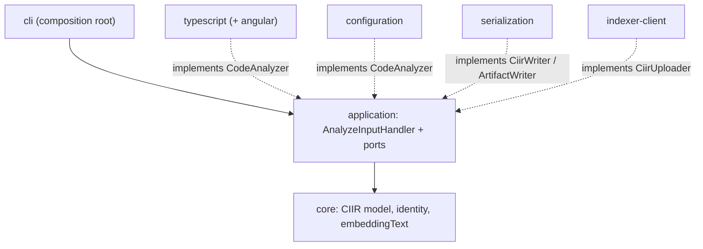

# code-brain-angular — CIIR generator for TypeScript / Angular

A Node.js CLI that statically analyzes **TypeScript/JavaScript** source — with first-class
**Angular** support — and produces **CIIR (Code Intelligence Intermediate Representation)**, the
same language-independent contract generated by
[`code-csharp-ciir`](../code-csharp-ciir) and [`code-java-ciir`](../code-java-ciir) and consumed by
the code-brain stack (`code-ciir-indexer` → `code-ciir-api` → `code-rag-front`).

- Semantic analysis with the **TypeScript Compiler API** (`TypeChecker`), never text matching.
- Angular: components, directives, pipes, services, modules, signals, inputs/outputs, DI,
  lifecycle hooks, **templates** (parsed with `@angular/compiler`), routes, functional guards,
  interceptors and `HttpClient` calls.
- Output validated against [`schemas/ciir.schema.json`](schemas/ciir.schema.json) (schema 1.2,
  identical to the C# generator's) and byte-for-byte deterministic.

See [`.specs/01-spec-inicial.md`](.specs/01-spec-inicial.md) for the requirements and
[`docs/ciir-specification.md`](docs/ciir-specification.md) for how TypeScript/Angular maps to CIIR.

## Usage

```bash
npx code-brain-angular <path> [options]           # published package, no install needed

# from source
npm ci && npm run build
node dist/cli/main.js <path> [options]
```

`<path>` may be an `angular.json` (every project of the workspace), a `tsconfig*.json` /
`jsconfig.json` / `package.json` (that project) or a directory (scanned recursively, skipping
`node_modules/`, `dist/`, `.angular/`, `.git/`, ...). Angular workspaces claim their whole tree;
other directories with a `tsconfig.json`/`package.json` become generic TS/JS projects.
`package.json`/`angular.json` (keys only — values are never captured) and `*.yaml`/`*.yml` (file
metadata) anywhere under the root are captured too.

**Install the analyzed project's dependencies first** (`npm ci`): without `node_modules`, imports
of packages end up as `unresolved` relations.

| Option | Meaning |
|---|---|
| `--output <path>` | Output directory (default `./ciir-output`). |
| `--verbose` | Diagnostic logging (warnings included) on stderr. |
| `--no-progress` | Suppress progress reporting. |
| `--no-banner` | Suppress the splash screen (also `CIIR_NOLOGO=1\|true`). |
| `--include-source` | Embed each entity's literal source text. |
| `--include-tests` | Also analyze `*.spec.*`, `*.test.*`, `cypress/`, `e2e/`. |
| `--fail-on-error` | Non-zero exit if any project fails to load/analyze. |
| `-s`, `--send [<base-url>]` | Upload `ciir.jsonl` to the code-ciir-indexer after a successful analysis (fallback: `CIIR_BASE_URL`). Put `<path>` **before** `-s`. |
| `-pi`, `--projectId <guid>` | With `--send`: the project id registered in the indexer (required). |
| `-ci`, `--clientId <id>` / `-cs`, `--clientSecret <secret>` | With `--send`: client credentials, exchanged at `POST {base}/api/indexer/auth/token`. |
| `-t`, `--token <jwt>` | With `--send`: Bearer token (wins over client credentials). |
| `--insecure` | With `--send`: do not validate the indexer's TLS certificate. |

Exit codes: `0` success · `1` project failure with `--fail-on-error` · `2` invalid
arguments/input · `3` output write failure · `4` unsupported environment (Node < 20) · `5` upload
failed · `130` cancelled (Ctrl+C).

```bash
node dist/cli/main.js ../code-rag-front --output ./ciir-output
node dist/cli/main.js ./angular.json -s https://blogdoft.home.arpa/code-brain -pi <guid> -ci ciir-pipeline -cs "$SECRET"
```

### Output

```text
ciir-output/
  ciir.jsonl            one CIIR document per line (streamed)
  ciir.schema.json      the contract
  manifest.json         generator, input, projects, file hashes, statistics
  analysis-report.json  success, counts, unresolved relations (first 200), errors, warnings
```

Example (a component, abridged):

```json
{"schemaVersion":"1.2","id":"sha256:…","kind":"type","language":"typescript","project":"demo-app",
 "symbol":{"name":"OrderListComponent","qualifiedName":"src/app/orders/order-list.component#OrderListComponent",…},
 "relations":[{"kind":"calls","target":{"id":"sha256:…","symbol":"…#OrderListComponent.select(Order)"},"resolution":{"status":"resolved","origin":"project"}},…],
 "extensions":{"angular":{"artifact":"component","selector":"app-order-list","injects":["src/app/orders/order.service#OrderService"],
   "template":{"path":"src/app/orders/order-list.component.html","usedComponents":["src/lib/badge.component#BadgeComponent"],…},…}},
 "embeddingText":"Entity: type\nQualified name: …\nFramework: Angular component\nSelector: app-order-list\n…"}
```

## Architecture

Hexagonal, mirroring the C# generator:



| Module | Role |
|---|---|
| `src/core` | CIIR model, identity hashing, modifier order, `embeddingText`. No dependencies. |
| `src/application` | Ports, input resolution, project discovery, `AnalyzeInputHandler`. Never imports `typescript`/`@angular/*`. |
| `src/typescript` | The only module importing `typescript` and `@angular/compiler`: symbol naming/resolution, relations, conditions, control flow, documents; `angular/` holds decorators, templates, routes, signals. |
| `src/configuration` | `package.json`/`angular.json` → `configuration(_key)`; YAML → `file`. |
| `src/serialization` | JSONL writer, manifest/report, schema copy. |
| `src/indexer-client` | `--send` upload (multipart, token gateway, `--insecure`). |
| `src/cli` | Argument parsing, splash, progress, exit codes. No analysis logic. |

## Development

```bash
npm ci
npm run build         # tsc → dist/
npm run typecheck     # src + tests
npm test              # vitest (all suites)
npx vitest run tests/typescript -t "routes"   # a single test
npm run format        # prettier
```

Tests mirror `src/`. `fixtures/basic-angular-app` is an Angular workspace with an application and a
library (for cross-project `solution` relations) analyzed by the integration tests; its Angular
dependencies resolve from this repository's own `node_modules` (dev dependencies).

## CI and releases

See [`.specs/02-ci-e-publicacao.md`](.specs/02-ci-e-publicacao.md).

- **Forgejo** `ci.yml`: formatting, type check, build, tests and `scripts/verify-package.sh`
  (pack, contents, `npx` install, smoke test) on every push to `main`, PR and tag; plus a
  dogfooding job that analyzes this repository (and, on a tag, sends it to the indexer).
- **Forgejo** `mirror-to-github.yml`: mirrors to `github.com/blogdoft/code-brain-angular`
  (weekdays 20:00–07:00 São Paulo time, any time on weekends, daily 20:00 run).
- **GitHub** `release.yml`: on a mirrored `vX.Y.Z` tag, validates, packs and — after approval on
  the `npm` environment — publishes to npmjs.com with provenance.

To release: `git tag v0.1.0 && git push origin v0.1.0`. The version comes from the tag only.
Check the package locally with `scripts/verify-package.sh 0.0.0-local.1`.

## License

GPL-3.0-only.
